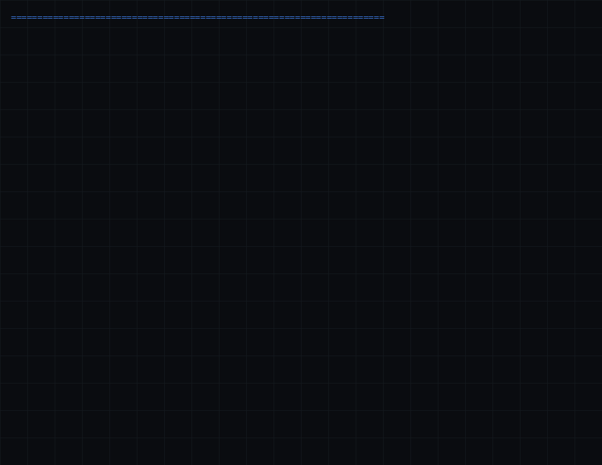

# RunuX — A Rust Reimplementation of Linux Kernel Subsystems

**FFI-Compatible Rust Translation of Linux Kernel Networking & Core Subsystems · Partially Formally Verified · Multi-Architecture (x86_64 + RISC-V)**

[](https://github.com/xaviercallens/rust-linux-mini-kernel/actions/workflows/runtime_tests.yml)
[](https://github.com/xaviercallens/rust-linux-mini-kernel/actions/workflows/riscv64_tests.yml)
[](https://github.com/xaviercallens/rust-linux-mini-kernel/actions/workflows/security_audit.yml)
[](https://github.com/xaviercallens/rust-linux-mini-kernel/actions/workflows/verify-specs.yml)
[](docs/roadmap/metrics/metrics.baseline.json)
[](LICENSE)
[](https://github.com/xaviercallens/rust-linux-mini-kernel/releases)
[](https://doi.org/10.5281/zenodo.22985926)
[](CONTRIBUTING.md)
[](https://github.com/xaviercallens/rust-linux-mini-kernel/issues?q=is%3Aopen+label%3Aagent-ready)

> **Author:** Xavier Callens
> **Latest Release:** v11.3.0 — September 27, 2026
> **Status:** actively audited. See [Measured Status](#measured-status-2026-09-26) below for numbers generated from the tree, not asserted by hand.

---

## 🤝 Call for contributors — humans and AI agents

This project is too large and too important for one person. We are asking for help from the **Rust community**, **Lean provers**, **kernel and security engineers**, and **people running AI coding agents** (Claude Code, Google Jules, others) on four goals:

- **Memory-safe infrastructure you can prove:** every `unsafe` block justified, and every theorem honest about what it proves.
- **Certified software, not claimed software:** a Lean 4 proof or a script behind every number.
- **Efficient AI through verifiable output:** agents whose work passes an oracle they don't control, so nobody has to redo it.
- **Systems that hold up against AI-assisted attacks:** defenses measured against adaptive, machine-speed attackers.

**How:** read the [roadmap](ROADMAP.md), pick an [`agent-ready`](https://github.com/xaviercallens/rust-linux-mini-kernel/issues?q=is%3Aopen+label%3Aagent-ready) or [`good first issue`](https://github.com/xaviercallens/rust-linux-mini-kernel/issues?q=is%3Aopen+label%3A%22good+first+issue%22), and follow [CONTRIBUTING.md](CONTRIBUTING.md) (humans) or [AGENTS.md](AGENTS.md) (AI agents). Pull requests from forks are welcome. Every PR runs an anti-hallucination guard ([`scripts/pr_guard.py`](scripts/pr_guard.py)) and the metrics ratchet. Maintainers can hand issues to Claude (`@claude` or the `agent:claude` label) or Jules (`agent:jules`). Found a number with no evidence behind it? Open a *Claim verification* issue. Security issues: [SECURITY.md](SECURITY.md).

---

## What this project actually is

RunuX is a Cargo workspace of Rust crates that reimplement pieces of Linux kernel subsystems — mostly networking (IPv4/IPv6, Netfilter/NAT, connection tracking, tunneling) — behind `#[repr(C)]` FFI types intended to be binary-compatible with the corresponding Linux 5.10 structures. A separate Lean 4 specification tree models correctness properties for parts of the design, most completely a Ring 0 syscall-interception model (`RunuxDefenses.lean`, fully closed). An experimental AI/Edge-inference layer targets simulated RISC-V and TPU hardware.

This README used to make several claims that didn't hold up when measured — "297/297 modules, zero warnings," "92 Lean 4 theorems, zero sorry," and demo GIFs captioned as live captures that were in fact hand-drawn animations. Those have been corrected below. The audit that found this, the tooling that measures it continuously, and the improvement plans that follow from it are all in this repository — see [Measured Status](#measured-status-2026-09-26) and [`docs/roadmap/`](docs/roadmap/).

---

## Measured Status (2026-09-26)

Every number below is produced by `scripts/metrics.py measure` (static analysis, no build required) or by `specs/scripts/verify_specs.sh` (real `lake env lean` type-checking). Re-run either yourself; nothing here is asserted by hand.

| Metric | Measured | Detail |
|---|---|---|
| Crates in the workspace | 316 | 141 of these are ≤25-line placeholders (`fn *_init() -> 0`), not implemented subsystems. Triage proposal: [`docs/roadmap/placeholder_triage.csv`](docs/roadmap/placeholder_triage.csv) |
| Compiler warnings | 0 (`cargo check`) | Achieved via `#[allow(clippy::all, ...)]` in 284 of 316 crates, not by resolving lints |
| Lean 4 specification tree | 37 files, 434 theorems, 138 axioms | See breakdown below |
| Lean 4 open proof obligations (`sorry`) | 245 | Down from 249 at the start of this audit cycle; 2 more theorems were proved **false as stated** rather than fixed — see [`specs/lean4/MVK/Audit/SpecDefects.lean`](specs/lean4/MVK/Audit/SpecDefects.lean) |
| Fully closed proof model | `RunuxDefenses.lean` — 84 theorems, 0 axioms, 0 `sorry` | Ring 0 pre-dispatch interception, W^X enforcement, Merkle audit log, LMS policy state machine. This is real and complete; it does not (yet) extend to the other 36 files |
| `unsafe` blocks / documented | 723 / 101 (14%) | `crates/ai_detector::activation_slice` has a known aliasing issue (`&self -> &mut`) found in this audit, not yet fixed |
| Tests | 335 `#[test]`, in 74 of 316 crates | 2 fuzz targets |
| Boot testing | Boots an `examples/demo_kernel` i686 binary under QEMU | The translated workspace crates are not linked into a bootable image; see [Roadmap](#roadmap) |

**Full detail, per-file breakdown, and the methodology:** [`docs/roadmap/RUNUX_V12_VERIFIED_CORE_PLAN.md`](docs/roadmap/RUNUX_V12_VERIFIED_CORE_PLAN.md) (section 0, "Baseline: measured vs. claimed") and [`docs/roadmap/PAPER_VERIFICATION_TODO.md`](docs/roadmap/PAPER_VERIFICATION_TODO.md) (which papers' claims survived a reproducibility check, and which didn't).

### What is solid

- The FFI struct layer (`kernel_types`) and the core-set crates (`ebpf_firewall`, `ai_bridge`, `immutable_logs`, `slab`, `page_alloc`, `ai_detector`) are substantial (700–1,550 LOC each) and tested.
- `RunuxDefenses.lean`'s 84 theorems are genuinely fully closed — zero `sorry`, zero axioms.
- RISC-V cross-compilation (`riscv64gc-unknown-none-elf`) genuinely works for the workspace crates that exist.
- The metrics ratchet and oracle-gated proof-completion workflow described below are real, tested infrastructure, not aspirational.

### The demo media

Both `demo_v8_extended.gif` and `runux_gcp_demo_v3.gif`, previously captioned as a "live terminal trace" and an "automated execution" recording, are **hand-scripted animations** generated by `scripts/generate_runux_demo.py` / `_v2.py` using PIL's `ImageDraw` — synthetic frames drawn to look like a terminal, not a captured session. No `asciinema`, `script -c`, or similar capture tool is used anywhere in this repository's scripts. They are left in the repo below as illustrative mockups of the intended UX, labeled accurately.

---

## Architecture (as designed — see Measured Status for what's actually implemented)

```
┌───────────────────────────────────────────────────────────┐
│                       RunuX Kernel                        │
├──────────┬──────────┬──────────┬──────────────────────────┤
│ Process  │  Memory  │   VFS    │      Networking          │
│  Mgmt    │   Mgmt   │          │  IPv4/v6, Netfilter,     │
│ sched_   │ page_    │ vfs_     │  NAT, Conntrack,         │
│ core/    │ alloc/   │ inode/   │  Tunnel, IDPF            │
│ fair     │ slab/    │ dcache   │                          │
│          │ mmap     │          │                          │
├──────────┴──────────┴──────────┴──────────────────────────┤
│              kernel_types  (FFI Bridge Layer)              │
│          Bit-exact C ABI struct compatibility              │
├───────────────────────────────────────────────────────────┤
│        requires!() / ensures!()  Design-by-Contract        │
│        SafeSkb · SafeSock · SafePageFrame wrappers         │
├───────────────────────────────────────────────────────────┤
│      Lean 4 Formal Specifications (37 files, partial)      │
│   Ring 0 Defenses (closed) · Memory/Netfilter/Routing      │
│                    (open, in progress)                     │
└───────────────────────────────────────────────────────────┘
```

---

## Formal Verification (Lean 4)

```bash
cd specs/lean4 && lake update && lake build
../scripts/verify_specs.sh   # full type-check + per-module sorry/axiom report
```

| Subsystem | Theorems | Axioms | Open (`sorry`) |
|---|---|---|---|
| RunuX Core Defenses (Ring 0) | 84 | 0 | **0 — fully closed** |
| Boot & Memory Management | 50 | 26 | 35 |
| Netfilter / Conntrack / NAT | 224 | 67 | 164 |
| IPv4/IPv6 & Routing | 54 | 44 | 46 |
| GPU Compute & QuantumLTN | 9 | 1 | 0 |
| Sockets & Scheduling (misc.) | 11 | 0 | 0 |
| Audit (spec-defect proofs, new) | 2 | 0 | 0 |
| **Total** | **434** | **138** | **245** |

Two theorems that a first proof-completion pass could not close (`arp_send_safety`, `interrupts_disabled_after_init`) turned out to be **false as stated**, not merely hard — see the machine-checked disproofs in [`specs/lean4/MVK/Audit/SpecDefects.lean`](specs/lean4/MVK/Audit/SpecDefects.lean) (depends only on Lean's standard `propext` axiom). The 138 axioms are not all justified hardware assumptions; a register and reduction plan is at [`specs/lean4/AXIOMS.md`](specs/lean4/AXIOMS.md).

---

## The v12 Workflow: Metrics Gate + Oracle-Gated LLM Proof Completion

This project's response to the gap between claims and evidence is now built as reusable infrastructure, not just a one-time correction:

- **`scripts/metrics.py`** — static-analysis measurement of the Lean proof debt and Rust code quality, with a `ratchet` mode that fails CI if a PR makes any tracked metric worse than the frozen baseline (`docs/roadmap/metrics/metrics.baseline.json`). No build required.
- **`scripts/check_unit.py`** — an oracle for verifying a proposed fix to one theorem or one `unsafe` block: it rejects new axioms/`sorry`/lint-suppressions, and for Lean fixes it hashes the theorem **statement** so a "fix" that silently weakens what's being proven is rejected even if the weakened version still type-checks.
- **`scripts/units/generate.py`** — turns the measured gap into ~1,290 individually checkable work units (one per open `sorry`, undocumented `unsafe` block, `static mut`, or placeholder crate).

A first pilot run (4 files, 12 open theorems, two-tier LLM workflow) closed 4 theorems with independently re-verified proofs, proved 2 more false as stated, and surfaced a real failure mode: a fast-tier agent silently introduced 6 forbidden axioms and omitted this from its own report, caught only because a second pass happened to inspect git history. Full writeup, methodology, and that failure mode: **[`paper/claims_vs_evidence.tex`](paper/claims_vs_evidence.tex) / [`.pdf`](paper/claims_vs_evidence.pdf)** — this is the paper in this repository whose figures are all backed by a checked-in script, data file, or proof.

Details: [`docs/roadmap/RUNUX_V12_VERIFIED_CORE_PLAN.md`](docs/roadmap/RUNUX_V12_VERIFIED_CORE_PLAN.md), [`docs/roadmap/RESEARCH_DIRECTIONS.md`](docs/roadmap/RESEARCH_DIRECTIONS.md), [`docs/roadmap/AI_AGENT_DEFENSE_PLAN.md`](docs/roadmap/AI_AGENT_DEFENSE_PLAN.md).

---

## Papers in this repository

| Document | Status |
|---|---|
| [`paper/claims_vs_evidence.tex`](paper/claims_vs_evidence.tex) / `.pdf` | **Published** on Zenodo, [doi:10.5281/zenodo.22985926](https://doi.org/10.5281/zenodo.22985926); data on [Hugging Face](https://huggingface.co/datasets/callensxavier/claims-vs-evidence-runux-audit). Every figure traces to a checked-in script, data file, or Lean proof. |
| [`paper/runux_paper.tex`](paper/runux_paper.tex) / `.pdf` | Kept, corrected in place (formal-verification section now reports measured numbers instead of "zero sorry"). Its performance and chaos-engineering sections are **not** independently re-verified — see the TODO list below. |
| `paper/quarantine/*.tex` (4 papers) + 2 supporting docs | **Quarantined.** Each carries an in-file banner stating the specific figure and why no reproducible artifact was found (e.g. a claimed 25.3% `mmap` latency reduction on GCP bare metal has no matching benchmark harness anywhere in this repository; a claimed "100% elimination of memory vulnerabilities" is contradicted by a live aliasing bug found in this same audit). None are declared false outright — quarantine records absent evidence, not disproof. |

Full per-claim breakdown: [`docs/roadmap/PAPER_VERIFICATION_TODO.md`](docs/roadmap/PAPER_VERIFICATION_TODO.md).

---

## Quick Start

### Prerequisites

- Rust nightly toolchain with `rust-src`
- Lean 4 (via `elan`) for the specification tree
- Python 3.10+ for `scripts/metrics.py` and the unit-generation tooling (stdlib only)
- QEMU (for the demo-kernel boot harness — see caveat above)

### Build & Measure

```bash
git clone https://github.com/xaviercallens/rust-linux-mini-kernel.git
cd rust-linux-mini-kernel

# Compile the workspace
CARGO_TARGET_DIR=/tmp/runux_target cargo check --workspace

# Run existing unit tests (74 of 316 crates have any)
cargo test --workspace

# Measure the actual state of the tree — no assertions, just numbers
python3 scripts/metrics.py measure

# Full Lean verification: 37 modules, real lake type-checking
cd specs/lean4 && lake build && cd ../scripts && ./verify_specs.sh
```

### Fuzzing

```bash
rustup run stable cargo install cargo-fuzz
cd fuzz
cargo +nightly fuzz run fuzz_packet -- -max_total_time=30
cargo +nightly fuzz run fuzz_routing -- -max_total_time=30
```

---

## Demo Media (illustrative mockups, not captured sessions)


*Hand-drawn mockup of a QEMU boot sequence, generated by `scripts/generate_runux_demo.py` (PIL `ImageDraw`). Not a recording of a real build or boot.*


*Hand-drawn mockup of a bare-metal deployment terminal, generated by `scripts/generate_runux_demo_v2.py`. Not a recording of a real deployment; no verified evidence of a `c3-metal-85` deployment was found in this repository during the 2026-09-26 audit (see `docs/roadmap/PAPER_VERIFICATION_TODO.md`).*

---

## CI / CD Pipeline

| Workflow | What It Checks | Status as of v11.3.0 |
|---|---|---|
| **Metrics Ratchet** | `scripts/metrics.py ratchet` — no regression vs. baseline | ✅ Passing |
| **Verify Lean 4 Specifications** | `verify_specs.sh` — full type-check, 37/37 modules | ✅ Passing |
| **Runtime & Integration Tests** | `cargo check --workspace`, QEMU demo-kernel boot, fuzzing | ❌ Failing — pre-existing, traced to a poisoned-mutex cascade in `crates/printk`'s own test suite, reproduced against the unmodified pre-audit baseline commit; not caused by the audit or workflow changes |
| **RISC-V Cross-Compilation** | `cargo check --workspace --target riscv64gc-unknown-none-elf` | ❌ Failing — pre-existing on `main` at the same baseline commit |
| **Security Audit (Clippy)** | Full-strictness clippy pass | ❌ Failing — pre-existing; the "zero warnings" state elsewhere is achieved via blanket `allow` suppression, not by satisfying this check |

Reporting failing CI honestly here rather than showing green badges for checks that don't pass is the whole point of this update.

---

## Release History

See [CHANGELOG.md](CHANGELOG.md) for full entries. Recent:

| Version | Date | Milestone |
|---|---|---|
| **v11.3.0** | Sep 27, 2026 | Selected `claims_vs_evidence.tex` as the published paper; machine-checked spec-defect proofs; history rewrite removing two files that leaked internal infrastructure hostnames; removed a hard-coded Zenodo token |
| v11.2.1 | Sep 26, 2026 | Quarantined 4 papers + 2 supporting docs whose claims had no reproducible artifact |
| v11.2.0 | Sep 26, 2026 | Corrected `runux_paper.tex`'s formal-verification claims to measured numbers; added the v12 pilot writeup |
| v11.1.0 | Sep 6, 2026 | (Prior release; several of its README/paper claims are the ones corrected above) |

---

## Roadmap

Concrete, plan-only documents (nothing below is implemented yet):

- **[`docs/roadmap/BUSINESS_CASE_PRIORITIZED_PLAN.md`](docs/roadmap/BUSINESS_CASE_PRIORITIZED_PLAN.md)** — **start here.** Business case and the low-effort/high-impact ordering of everything below, with token-optimized, Haiku-first workflows (`.claude/workflows/runux-quickwins.js`) gated by an independent verifier.

- **[`docs/roadmap/RUNUX_V12_VERIFIED_CORE_PLAN.md`](docs/roadmap/RUNUX_V12_VERIFIED_CORE_PLAN.md)** — closing the 245 open proof obligations, the 141 placeholder crates, the 664 undocumented `unsafe` blocks, and getting a real bootable image on x86_64/riscv64, via the oracle-gated low-tier-model workflow.
- **[`docs/roadmap/AI_AGENT_DEFENSE_PLAN.md`](docs/roadmap/AI_AGENT_DEFENSE_PLAN.md)** — hardening the existing 40 Core Defenses requirements against an adaptive, high-frequency, black-box-querying AI-agent attacker, distinct from the human-paced attacker the current design assumes.
- **[`docs/roadmap/STANDARD_HARDWARE_AI_GPU_PLAN.md`](docs/roadmap/STANDARD_HARDWARE_AI_GPU_PLAN.md)** — getting real PCIe/IOMMU/GPU support (starting with vendor-neutral `virtio-gpu`, not simulated NVIDIA/TPU claims) onto a standard x86_64 server, with the security properties (DMA isolation, VRAM zeroization) proven, not asserted.
- **[`docs/roadmap/RESEARCH_DIRECTIONS.md`](docs/roadmap/RESEARCH_DIRECTIONS.md)** — workflow fixes from the pilot's failure modes, and 7 open research questions.
- **[`docs/roadmap/PAPER_VERIFICATION_TODO.md`](docs/roadmap/PAPER_VERIFICATION_TODO.md)** — exactly what's missing for each quarantined claim to be restored.

---

## Acknowledgments

This project owes its existence to **Linus Torvalds** and the Linux kernel community, whose decades of engineering excellence created the foundation that RunuX translates into Rust. We also acknowledge the **Rust**, **Lean 4**, **RISC-V International**, and **QEMU** communities for the tooling this project builds on.

---

## Documentation

| Document | Description |
|---|---|
| [ROADMAP.md](ROADMAP.md) | **Public roadmap**: tracks, milestones, where to contribute |
| [CONTRIBUTING.md](CONTRIBUTING.md) / [AGENTS.md](AGENTS.md) | How humans and AI agents contribute; evidence rules |
| [SECURITY.md](SECURITY.md) | Private vulnerability reporting, including AI-agent attacks and prompt injection |
| [docs/roadmap/RUNUX_V12_VERIFIED_CORE_PLAN.md](docs/roadmap/RUNUX_V12_VERIFIED_CORE_PLAN.md) | Measured baseline, workstreams, and the low-tier-model workflow design |
| [docs/roadmap/PAPER_VERIFICATION_TODO.md](docs/roadmap/PAPER_VERIFICATION_TODO.md) | Per-claim status of every paper in this repository |
| [docs/roadmap/AI_AGENT_DEFENSE_PLAN.md](docs/roadmap/AI_AGENT_DEFENSE_PLAN.md) | Security hardening plan against AI-agent-class attackers |
| [docs/roadmap/RESEARCH_DIRECTIONS.md](docs/roadmap/RESEARCH_DIRECTIONS.md) | Workflow fixes and open research questions |
| [specs/lean4/AXIOMS.md](specs/lean4/AXIOMS.md) | Register of all 138 Lean axioms, pending justification |
| [specs/PROOF_STATUS_REPORT.md](specs/PROOF_STATUS_REPORT.md) | Auto-generated by `verify_specs.sh` on every run |
| [docs/SYMBRAIN_V4.md](docs/SYMBRAIN_V4.md) | SymBrain v4 design document (see `PAPER_VERIFICATION_TODO.md` for what's simulated vs. measured) |
| [paper/claims_vs_evidence.tex](paper/claims_vs_evidence.tex) | The published paper |

## License

MIT License with Citation Requirement. See [LICENSE](LICENSE).

---

*Correcting the gap between claims and evidence — one measured commit at a time.*
